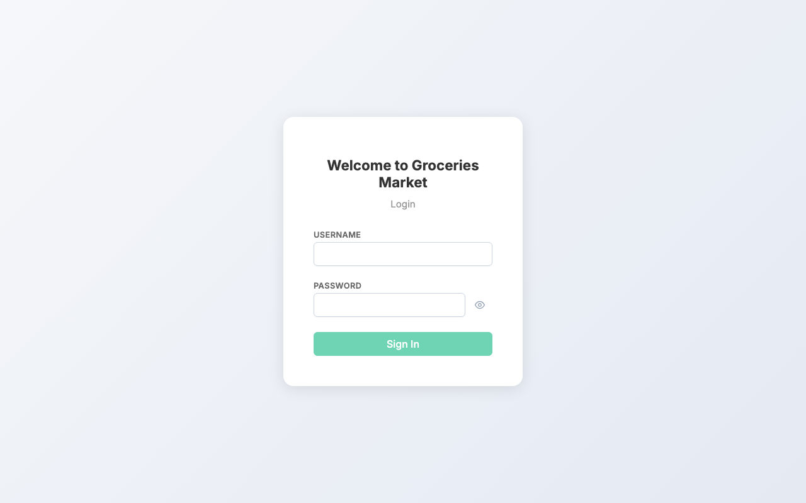
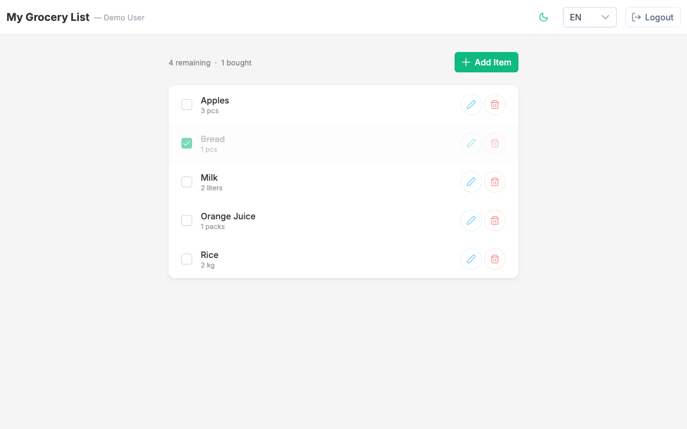
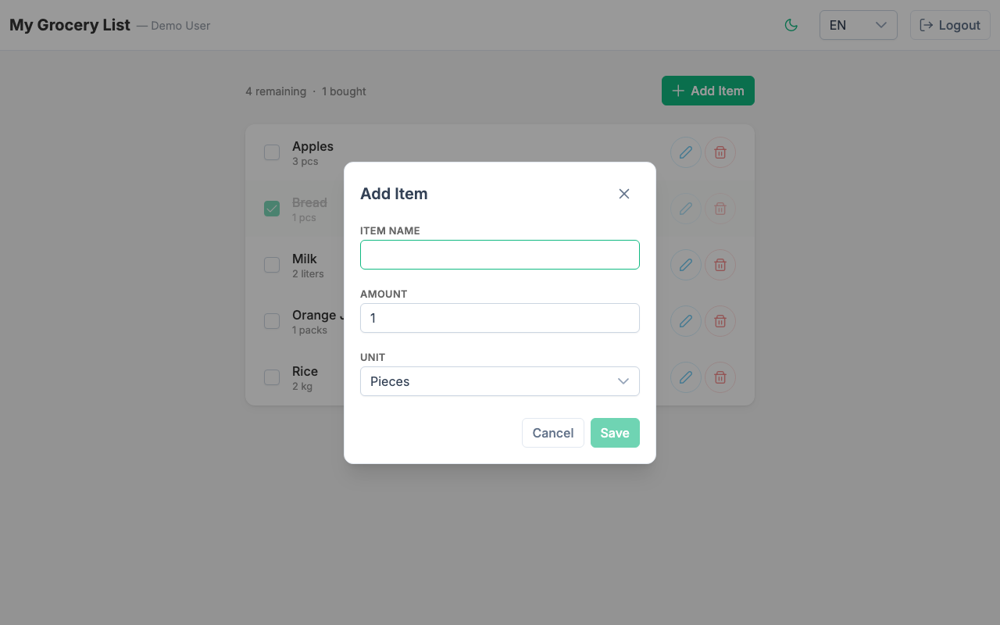
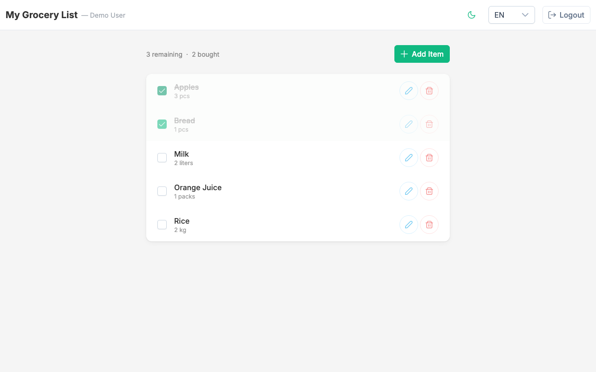
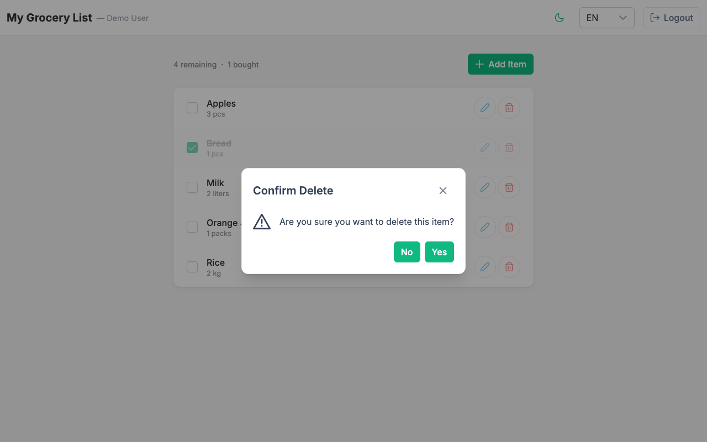
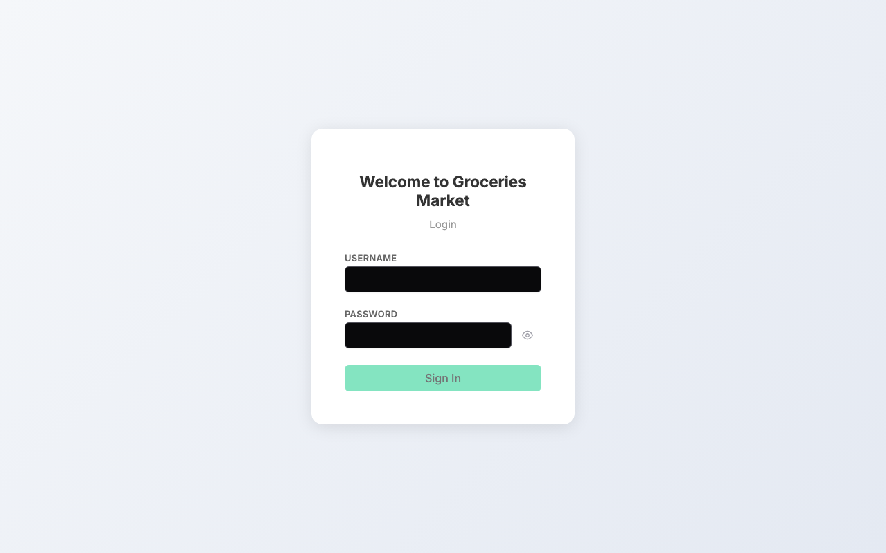
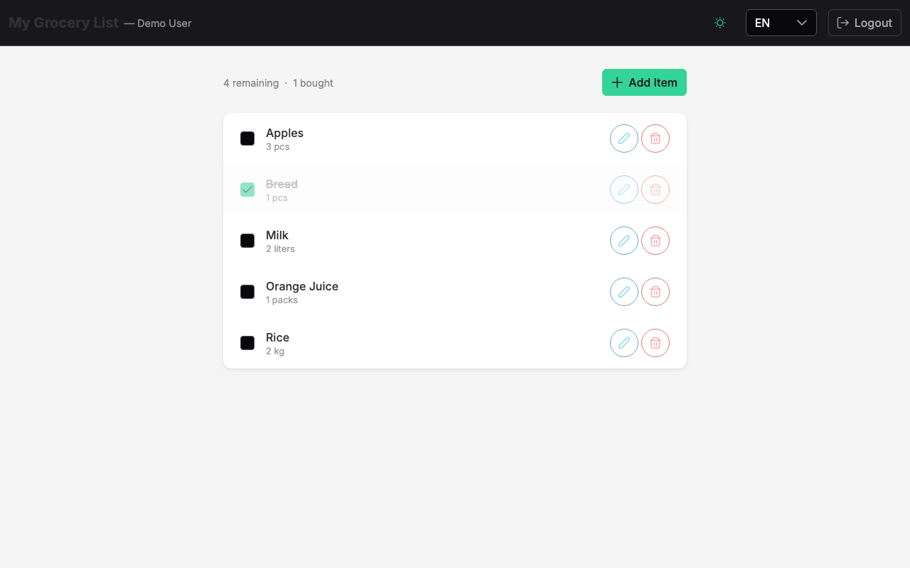
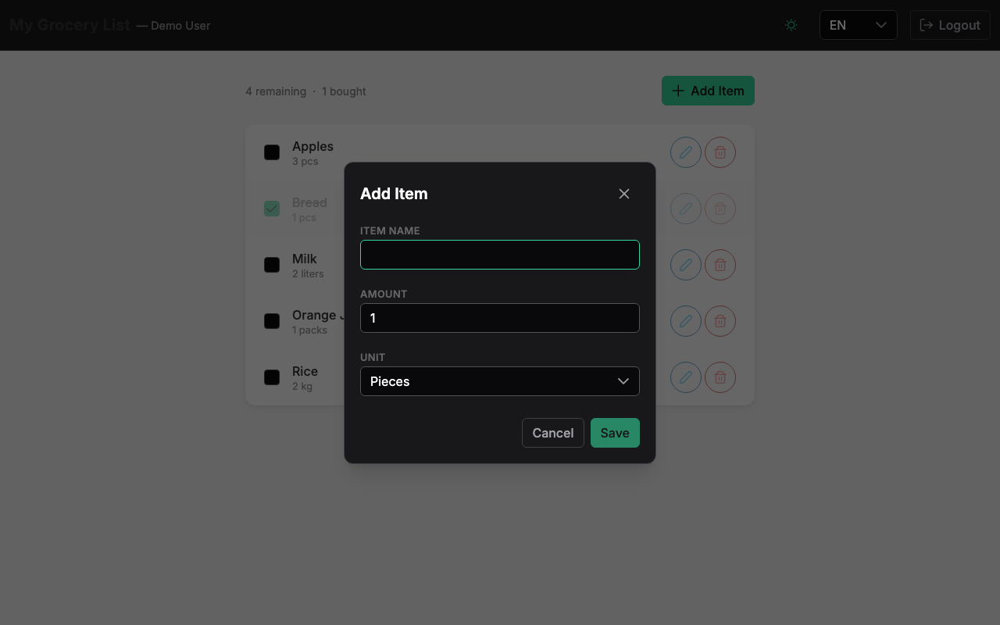
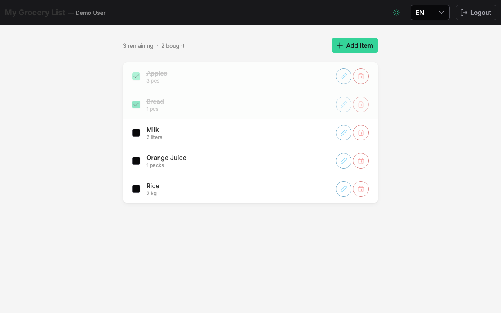
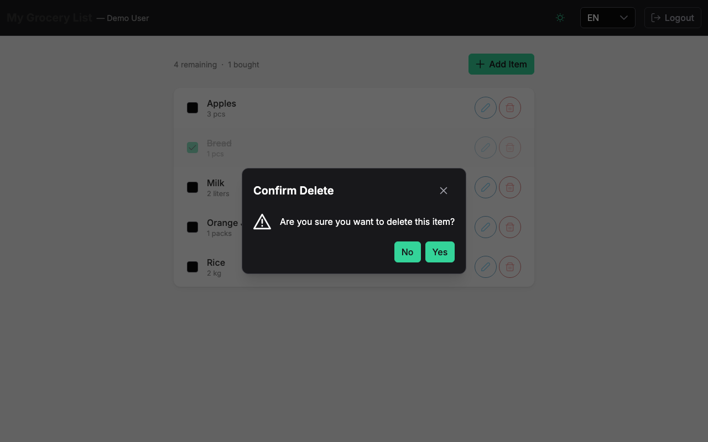

# Groceries Market

A grocery list management application built with **Angular 21**, **PrimeNG**, and **json-server**.

Users can log in, manage a personal grocery list (add, edit, delete items), set amounts with units, and mark items as bought. The app supports **real-time sync** via WebSocket simulation, **offline mode** with IndexedDB caching and sync queue, **i18n** (English / Ukrainian), **dark/light theme** with system preference detection, and follows enterprise Angular architecture patterns.

## Live Demo

**[groceries-market.vercel.app](https://groceries-market.vercel.app)** — deployed on Vercel with serverless mock API

Demo credentials: `demo` / `demo123`

## Screenshots

### Light Theme

| Login | Grocery List | Add Item |
|-------|-------------|----------|
|  |  |  |

| Mark as Bought | Delete Confirmation |
|---------------|-------------------|
|  |  |

### Dark Theme

| Login | Grocery List | Add Item |
|-------|-------------|----------|
|  |  |  |

| Mark as Bought | Delete Confirmation |
|---------------|-------------------|
|  |  |

## Features

### Core
- **Login/logout** with token-based auth, route guards, and HTTP interceptors
- **Full CRUD** — add, edit, delete grocery items with form validation
- **Amount & unit tracking** — pieces, kilograms, liters, packs
- **Mark as bought** — checkbox with strikethrough, optimistic UI updates

### Advanced
- **Real-time sync (WebSocket mock)** — simulates live collaboration with other users. Events (add/update/delete/toggle) from virtual users trigger toast notifications and automatic list refresh. Header shows a live connection status indicator (green = connected, amber pulse = reconnecting, grey = disconnected)
- **Offline support (Service Worker + IndexedDB)** — custom service worker caches static assets (cache-first) and API responses (network-first with fallback). IndexedDB stores grocery items locally. When offline, all mutations (add/edit/delete/toggle) are queued and automatically replayed when connectivity returns. An amber offline banner appears when disconnected
- **Optimistic updates** — toggle and delete operations update the UI instantly via signal mutations, syncing with the server in the background. On error, changes are rolled back

### UI/UX
- **Dark/light theme** — auto-detects OS preference, manual toggle, persisted in localStorage
- **Internationalization** — English and Ukrainian with runtime language switching
- **Responsive design** with PrimeNG Aura theme
- **Toast notifications** for success, error, and real-time events
- **Confirmation dialogs** for destructive actions
- **Auto-focus** on form inputs

## Tech Stack

| Technology | Version | Purpose |
|-----------|---------|---------|
| Angular | 21.2 | Frontend framework (standalone components, signals) |
| PrimeNG | 21 | UI component library (Aura theme) |
| json-server | 0.17 | Mock REST API (development) |
| Vercel Serverless | - | Mock API (production deployment) |
| ngx-translate | 17 | i18n (EN, UA) |
| Vitest | 4 | Unit testing (77 tests) |
| Playwright | 1.59 | E2E testing (12 tests) |
| SCSS | - | Styling with variables, mixins, theming |
| TypeScript | 5.9 | Strict mode enabled |
| IndexedDB | - | Offline data storage + sync queue |

## Getting Started

### Prerequisites

- Node.js 20+
- npm 10+

### Installation

```bash
git clone https://github.com/Dmitriymush/Groceries-market.git
cd Groceries-market
npm install
npx playwright install chromium
```

### Running the Application

Start both the Angular dev server and json-server mock API:

```bash
npm run dev
```

This starts:
- Angular app at `http://localhost:4200`
- json-server API at `http://localhost:3001`

### Demo Credentials

| Username | Password |
|----------|----------|
| demo | demo123 |

### Available Scripts

| Script | Description |
|--------|-------------|
| `npm run dev` | Start Angular + json-server concurrently |
| `npm run start` | Start Angular dev server only |
| `npm run api` | Start json-server only |
| `npm run build` | Production build |
| `npm run test` | Run unit tests (Vitest) |
| `npm run e2e` | Run E2E tests (Playwright) |
| `npm run e2e:ui` | Run E2E tests with Playwright UI |

## Project Architecture

```
src/app/
  core/                    # Singleton services, guards, interceptors
    api/                   # HTTP API layer (one class per entity)
    auth/                  # Auth service + helper
    guards/                # Route protection (auth, no-auth)
    interceptors/          # HTTP interceptors (apiUrl, auth, error)
    services/              # Business logic, real-time, offline sync
    models/                # Data interfaces (grocery, auth, websocket)
    helpers/               # Cross-cutting pure helpers
    translate/             # i18n configuration
  modules/                 # Feature modules (lazy-loaded)
    auth/                  # Login page
    groceries/             # Grocery list + CRUD components
      pages/               # Smart (container) components
      components/          # Dumb (presentational) components
      helpers/             # Module-scoped helpers
      models/              # ViewModel interfaces
  shared/                  # Reusable across modules
    components/            # Confirm dialog, page header, spinner
    directives/            # Auto-focus directive
api/                       # Vercel serverless functions (production mock API)
mock-server/               # json-server seed data (development)
e2e/                       # Playwright E2E tests
public/                    # Static assets + service worker
nginx/                     # Production nginx config
```

## Architecture Patterns

### SOLID Principles

| Principle | Implementation |
|-----------|---------------|
| **Single Responsibility** | One API class per entity, one service per domain, one component per UI concern |
| **Open/Closed** | Helper classes extensible via new static methods |
| **Liskov Substitution** | Dumb components interchangeable with same input/output contract |
| **Interface Segregation** | Small focused interfaces (GroceryItem, GroceryFormData, LoginRequest) |
| **Dependency Inversion** | Smart components depend on service abstractions, dumb components on inputs only |

### Signals vs RxJS

| Signals | RxJS |
|---------|------|
| Component state (loading, editing, connectivity) | HTTP requests via HttpClient |
| ViewModel composition via `computed()` | Stream transformations (switchMap, catchError) |
| Service state exposure (items, wsStatus, isOnline) | Interceptor chains |
| Dumb component `input()` / `output()` | WebSocket event stream |

### ViewModel Pattern

The `GroceryService` owns both state and derived view data via a `computed()` ViewModel signal. Smart components consume `groceryService.vm` directly:

```typescript
// In GroceryService
readonly vm = computed<GroceryListViewModel>(() => ({
  items: GroceryViewHelper.sortByName(this._items()),
  loading: this._loading(),
  totalItems: this._items().length,
  hasItems: this._items().length > 0,
  boughtCount: GroceryViewHelper.countBought(this._items()),
  remainingCount: GroceryViewHelper.countRemaining(this._items()),
}));

// In GroceryListComponent (smart)
protected readonly vm = this.groceryService.vm;
```

### Smart / Dumb Components

- **Smart (Container)**: Located in `modules/*/pages/`, inject services, own UI state signals, orchestrate CRUD
- **Dumb (Presentational)**: Located in `modules/*/components/`, receive data via `input()`, emit events via `output()`, zero service injection

### Helper Pattern

Abstract classes with static methods for pure transformations:

```typescript
export abstract class GroceryViewHelper {
  static sortByName(items: GroceryItem[]): GroceryItem[] { ... }
  static countBought(items: GroceryItem[]): number { ... }
}
```

Used at three levels: `core/helpers/` (cross-cutting), `core/auth/` (auth-specific), `modules/*/helpers/` (module-scoped).

## Real-Time Sync (WebSocket Mock)

The `GroceryWebSocketService` simulates WebSocket-based real-time collaboration:

- **Connection lifecycle**: `disconnected` → `reconnecting` (1.5s delay) → `connected`
- **Event simulation**: emits random grocery events (add/update/delete/toggle) from virtual users every 20 seconds
- **UI integration**: `GroceryService` subscribes to events, refreshes the list, and shows toast notifications
- **Status indicator**: header displays a colored dot — green (live), amber pulsing (reconnecting), grey (disconnected)

The service exposes the same observable-based API (`events$`, `connectionStatus` signal) that a real WebSocket integration would use, making it a drop-in replacement.

## Offline Support

### Service Worker (`public/sw.js`)

Custom service worker implementing two caching strategies:
- **Static assets**: cache-first (serve from cache, fall back to network)
- **API responses**: network-first (try network, fall back to cached response)

Registered in `main.ts` after Angular bootstrap.

### IndexedDB Store (`OfflineStoreService`)

Raw IndexedDB wrapper (no library dependency) with two object stores:
- **grocery_items**: cached grocery list for offline reading
- **sync_queue**: queued mutations (POST/PATCH/DELETE) for later replay

### Sync Queue (`SyncService`)

- Watches `ConnectivityService.isOnline` signal via `effect()`
- When connectivity returns, drains the queue and replays each mutation
- Failed entries are re-enqueued for the next attempt
- Shows success/error toast with count of synced changes

### Offline UX

- Amber banner: "You're offline — changes will sync when reconnected" (i18n EN/UA)
- All CRUD operations work offline — mutations are queued transparently
- `GroceryService.loadItems()` falls back to IndexedDB cache when API is unreachable

## Interceptor Chain

1. **apiUrlInterceptor** — Prepends `environment.apiUrl` to relative API paths
2. **authInterceptor** — Attaches `Authorization: Bearer <token>` header
3. **errorInterceptor** — Handles 401 (logout + redirect) and 5xx (toast notification)

## i18n

- Languages: English (en), Ukrainian (ua)
- Language switcher in the header toolbar
- Translation files: `src/assets/i18n/en.json`, `src/assets/i18n/ua.json`
- All UI labels translated, including unit dropdown options and offline banner

## Dark / Light Theme

- **Auto-detection**: On first visit, the theme matches your OS preference (`prefers-color-scheme`)
- **Manual toggle**: Click the moon/sun icon in the header toolbar to switch
- **Persistence**: Theme choice is saved to `localStorage` and restored on reload
- **Implementation**: PrimeNG Aura theme with `darkModeSelector: '.app-dark'` — toggling adds/removes the `.app-dark` class on `<html>`
- **ThemeService** (`core/services/theme.service.ts`): Singleton service exposing `mode` signal, `isDark()` getter, and `toggle()` method

## Testing

### Unit Tests (Vitest)

77 tests across 24 test files covering:

- API layer (HTTP calls with `HttpTestingController`)
- Services (state transitions, ViewModel computation, optimistic updates)
- WebSocket service (connection lifecycle, event emission, disconnect)
- Offline services (IndexedDB store, connectivity detection, sync queue replay)
- Guards (redirect behavior)
- Interceptors (token attachment, URL prepending, error handling)
- Helpers (pure function tests)
- Components (input rendering, output emission, form validation)
- Directives

```bash
npm run test
```

### E2E Tests (Playwright)

12 tests across 3 spec files:

- **auth.spec.ts**: Login form display, invalid credentials, successful login, guard redirect, logout
- **grocery-crud.spec.ts**: View list, add item, edit item, delete with confirmation
- **grocery-bought.spec.ts**: Mark as bought (strikethrough + checkbox), unmark, checkbox state

```bash
npm run e2e
```

## Deployment

### Vercel (Production)

The app deploys to Vercel with zero configuration beyond `vercel.json`:

- **Frontend**: Angular production build served as static SPA
- **API**: Serverless functions in `api/` directory replicate the json-server mock
- **Routing**: SPA fallback rewrites non-API routes to `index.html`
- **Seed data**: 5 pre-loaded grocery items so the demo is immediately usable

### Build

```bash
npm run build
```

### Nginx

Production nginx config included at `nginx/nginx.conf` with SPA fallback routing and API proxy.

## Decisions

See [DECISIONS.md](DECISIONS.md) for detailed explanations of architectural trade-offs — why signals over NgRx, json-server over in-memory API, custom service worker over `@angular/service-worker`, and more.
